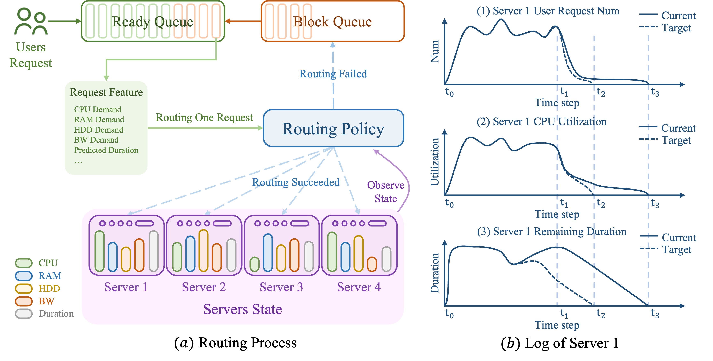
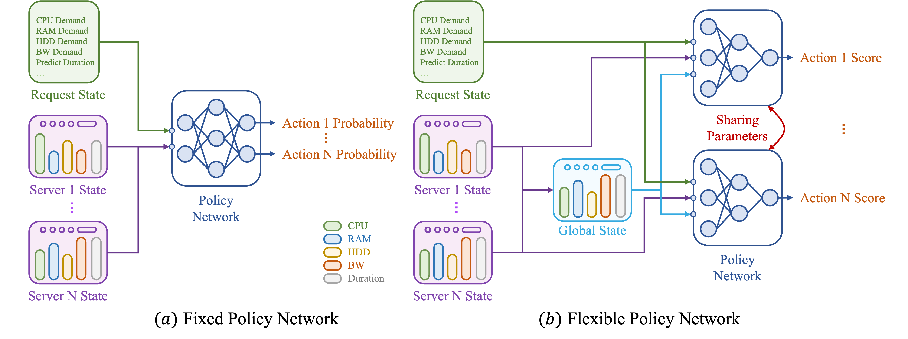
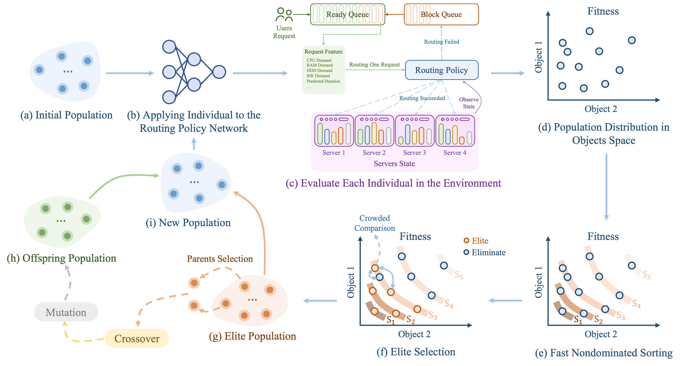

# SCIS23 Reducing Idleness in Financial Cloud via Multi-objective Evolutionary Reinforcement Learning based Load Balancer

[paper link](https://link.springer.com/article/10.1007/s11432-023-3895-3)

In recent years, various companies started to shift their data services from traditional data centers onto cloud. One of the major motivations is to save operation costs with the aid of cloud elasticity. This paper discusses an emerging need from financial services to reduce idle servers retaining very few user connections, without disconnecting them from the server side. This paper considers this need as a bi-objective online load balancing problem. A neural network based scalable policy is designed to route user requests to varied numbers of servers for elasticity. An evolutionary multi-objective training framework is proposed to optimize the weights of the policy. Not only the new objective of idleness is reduced by over 130\% more than traditional industrial solutions, but the original load balancing objective is slightly improved. Extensive simulations help reveal the detailed applicability of the proposed method to the emerging problem of reducing idleness in financial services.


## Overview

<!-- 

 -->



## Dependencies

System

```bash
ubuntu 20.04
python 3.8.12
cuda 11.0
```

Packages

```bash
torch==1.11.0
numpy
```

## Training

```bash
python xxx_train_xxx.py
```

## Testing

```bash
python xxx_test_xxx.py
```


## Results
Please check it in the paper `doc/MERL-LB-v1.pdf`.
